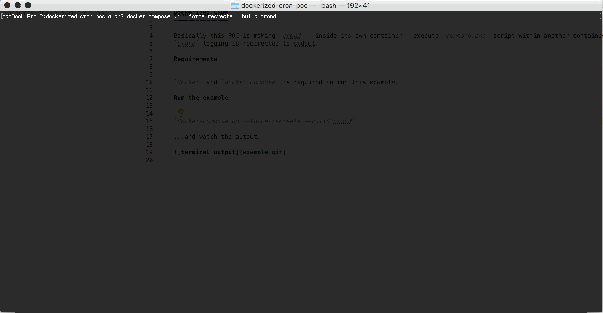

Dockerized CRON
---------------

Basically this POC is making `crond` - inside its own container - execute `command.php` script within another container every 1 minute.
`crond` logging is redirected to stdout.

Requirements
------------

`docker` and `docker-compose` is required to run this example.

Run the example
---------------

`docker-compose up --force-recreate --build crond`

...and watch the output.

